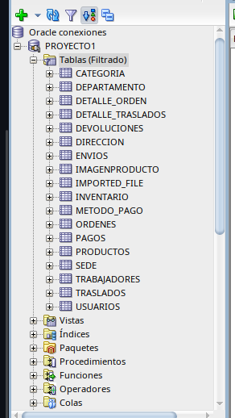
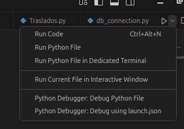

# 📌 Universidad de San Carlos de Guatemala  
### 🏛 Facultad de Ingeniería - Escuela de Ciencias y Sistemas  
### 🖥 Sistemas de base de datos, Sección: N  

## 👤 Nombre: **Edgar Josías Cán Ajquejay**  
## 🎓 Carnet: **202112012**  

## 🏥 **MANUAL DE USUARIO**  
---

# Para poder levantar el proyecto se requiere lo siguiente:
- Instalar Oracle Database XE
- Instalar SQL Developer
- Cargar la base de datos a SQL
- Levantar la API
- POSTMAN

# Instalación y Configuración de Oracle Database XE, SQL Developer y API Flask

## Instalación de Oracle Database XE en Docker

### 1. Descargar la imagen de Oracle XE
```bash
docker pull container-registry.oracle.com/database/express:21.3.0-xe
```

### 2. Crear y ejecutar el contenedor
```bash
docker run -d --name oracle-xe \
  -p 1521:1521 -p 5500:5500 \
  -e ORACLE_PWD=oracle \
  container-registry.oracle.com/database/express:21.3.0-xe
```

### 3. Verificar que el contenedor esté corriendo
```bash
docker ps
```

### 4. Conectarse al contenedor
```bash
docker exec -it oracle-xe sqlplus sys/oracle@//localhost:1521/XEPDB1 as sysdba
```

## Instalación de SQL Developer

### 1. Descargar e instalar SQL Developer
Descargar SQL Developer desde [Oracle SQL Developer](https://www.oracle.com/tools/downloads/sqldev-downloads.html)

### 2. Configurar conexión en SQL Developer
- Abrir SQL Developer.
- Crear una nueva conexión.
  - **Nombre:** `oracle-xe`
  - **Usuario:** `system`
  - **Contraseña:** `oracle`
  - **Host:** `localhost`
  - **Puerto:** `1521`
  - **SID/Service Name:** `XEPDB1`

### configuracion del servidor creado


### posteriormente se procede a cargar la base de datos en el apartado de PROYECTO1 


### luego se presionar en el boton de una hoja y el boton de play para ejecutar el script de la base de datos


### en la parte izquierda se encuentra la base de datos del proyecto en donde se le da en la carpeta de tablas clic derecho
y en refrescar para que puedan aparecer las tablas


### OJO(si aun no se cargaron todas las tablas hay que volver a seleccionar el boton de la hoja y el boton de play y nuevamente refrescar esto puede hacerse hasta que aparezcan todas las tablas con ello ya tendremos la base de datos funcional)



## Levantar la API con Flask y cx_Oracle y cargar datos por medio de Python

### Abrir visual studio code en tu sistema y aparecera de la siguiente manera


### 1. Crear entorno virtual e instalar dependencias en visual studio code 
```bash
python -m venv venv
source venv/bin/activate  
pip install flask cx_Oracle bcrypt
```
### 2. En la parte izquierda en la carpeta de CARGAS aparecen varios archivos.py a cada uno hay que cargarlos por ejemplo en usuarios.py


### 3. En la parte superior derecha aparece un simbolo de play se le da clic y automaticamente cargara los datos a la base de datos SQL



### 4. buscar el archivo API.py tendra el siguiente codigo(se uso una parte como base)
```python
from flask import Flask, request, jsonify
import cx_Oracle
import bcrypt
from db_connection import get_connection

app = Flask(__name__)

@app.route('/api/users', methods=['POST'])
def create_user():
    try:
        data = request.json

        hashed_password = bcrypt.hashpw(data["password"].encode("utf-8"), bcrypt.gensalt()).decode("utf-8")
        conn = get_connection()
        cursor = conn.cursor()
        
        insert_query = """
        INSERT INTO Usuarios (Id_Usuario, Identificacion_Nacional, Nombre, Apellido, Telefono, Email, Contraseña, Activo, Correo_Confirmado, created_at, updated_at)
        VALUES (usuario_seq.NEXTVAL, :1, :2, :3, :4, :5, :6, :7, :8, SYSTIMESTAMP, SYSTIMESTAMP)
        """
        
        cursor.execute(insert_query, (
            data["identificacion"], data["nombre"], data["apellido"], data["telefono"],
            data["email"], hashed_password, data.get("activo", 1), data.get("correo_confirmado", 0)
        ))

        conn.commit()
        cursor.close()
        conn.close()
        
        return jsonify({"status": "success", "message": "Usuario creado correctamente"}), 201

    except cx_Oracle.DatabaseError as e:
        return jsonify({"status": "error", "message": "Error en la base de datos", "details": str(e)}), 500

if __name__ == '__main__':
    app.run(debug=True)
```

### 5. Levantar la API en la consola de visual 
```bash
python api.py
```
### en la parte de abajo aparecera el enlace del puerto al que esta conectado, tomarlo en cuenta para los siguientes pasos

### 6. Probar en Postman
- abre postman en tu computadora si no lo tienes lo puedes descargar aca: Descargar postman desde [POSTMAN](https://www.postman.com/downloads/)
- Seleccionar en new 
- Seleccionar la opcion de HTTP
- Posteriormente seleccionar en body
- Luego seleccionar RAW
- En la parte de cuadro para ingresar texto donde aparece normalmente como GET seleccionar y cambiar a post y colocar la siguiente
  direccion: tomar en cuenta que esta automaticamente lo activa la api copiar ese enlace que aparecera en la parte de abajo de la consola de visual y pegarlo en ese apartado
- **POST** `http://127.0.0.1:5000/api/users`
- posteriormente en el cuadro mas grande se ingresar una peticion de la API como en este caso se procedera a cargar un usuario
- **Body (JSON):**
```json
{
    "identificacion": "12345678",
    "nombre": "Juan",
    "apellido": "Perez",
    "telefono": "12345678",
    "email": "juan@example.com",
    "password": "claveSegura123"
}
```
-debe quedar de esta forma


-luego seleccionar en SEND en el apartado derecho y debera aparecer que el usuario fue agregado con exito. esto se aplica para las demas peticiones en markdown.

```markdown
