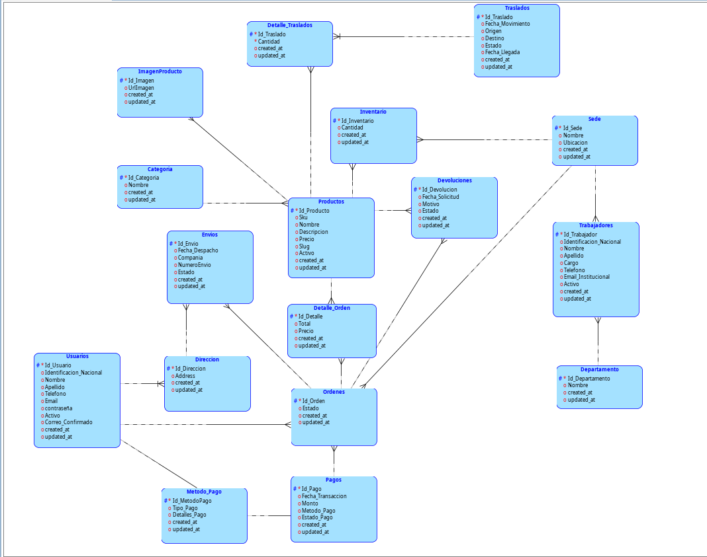

# Manual Técnico

Se identificaron las siguientes tablas con sus respectivos atributos.

| #  | Entidad       | Atributos                                                                 |
|----|-------------|---------------------------------------------------------------------------|
| 1  | Usuarios    | id, identificacion_nacional, nombre, apellido, correo_electronico, numero_telefono, activo, fecha_registro, correo_confirmado, direcciones, metodos_pago_preferidos, created_at, updated_at |
| 2  | Trabajadores | id, identificacion_nacional, nombre, apellido, cargo, departamento, numero_telefono, correo_institucional, sede_asignada, activo, created_at, updated_at |
| 3  | Productos   | id, sku, nombre, descripcion, precio, slug, cantidad_inventario_por_sede, categoria, activo, imagenes_asociadas, created_at, updated_at |
| 4  | Órdenes     | id, fecha_creacion, id_cliente, lista_productos, cantidades_y_precios_unitarios, created_at, updated_at |
| 5  | Pagos       | id, id_orden_compra, fecha_transaccion, monto_total, metodo_pago, estado_pago, created_at, updated_at |
| 6  | Envíos      | id, fecha_despacho, id_orden_compra, direccion_entrega, empresa_transporte, numero_seguimiento, estado_envio, created_at, updated_at |
| 7  | Devoluciones | id, id_orden_compra, fecha_solicitud, motivo_devolucion, estado_devolucion, producto_relacionado, created_at, updated_at |
| 8  | Traslados   | id, fecha_movimiento, almacen_origen, almacen_destino, lista_productos_trasladados, cantidad_transferida, estado_traslado, fecha_estimada_llegada, created_at, updated_at |

Posteriormente se realizo la normalizacion de las tablas desde la forma 1FN hasta la forma 3FN de la base de datos asi como de sus relaciones entre cada tabla, la destruccion de las relaciones muchos a muchos de ciertas entidades. para obtener finalmente la base de datos normalizada la cual es la siguiente:

| #  | Entidad             | Atributos                                                                                                                                                                           |
|----|---------------------|-------------------------------------------------------------------------------------------------------------------------------------------------------------------------------------|
| 1  | Categoria           | Id_Categoria, Nombre, created_at, updated_at                                                                                                                                        |
| 2  | Departamento        | Id_Departamento, Nombre, created_at, updated_at                                                                                                                                       |
| 3  | Detalle_Orden       | Id_Detalle, Productos_Id_Producto, Ordenes_Id_Orden, Total, Precio, created_at, updated_at                                                                                            |
| 4  | Detalle_Traslados   | Id_Traslado, Cantidad, created_at, updated_at, Traslados_Id_Traslado, Productos_Id_Producto                                                                                           |
| 5  | Devoluciones        | Id_Devolucion, Fecha_Solicitud, Motivo, Estado, created_at, updated_at, Ordenes_Id_Orden, Productos_Id_Producto                                                                      |
| 6  | Direccion           | Id_Direccion, Address, created_at, updated_at, Usuarios_Id_Usuario                                                                                                                    |
| 7  | Envios              | Id_Envio, Fecha_Despacho, Compania, NumeroEnvio, Estado, created_at, updated_at, Ordenes_Id_Orden, Direccion_Usuarios_Id_Usuario, Direccion_Id_Direccion                                |
| 8  | ImagenProducto      | Id_Imagen, UrlImagen, created_at, updated_at, Productos_Id_Producto                                                                                                                   |
| 9  | Inventario          | Id_Inventario, Cantidad, created_at, updated_at, Sede_Id_Sede, Productos_Id_Producto                                                                                                  |
| 10 | Metodo_Pago         | Id_MetodoPago, Tipo_Pago, Detalles_Pago, created_at, updated_at, Usuarios_Id_Usuario                                                                                                  |
| 11 | Ordenes             | Id_Orden, Estado, Pagos_Id_Pago, created_at, updated_at, Sede_Id_Sede, Usuarios_Id_Usuario                                                                                             |
| 12 | Pagos               | Id_Pago, Fecha_Transaccion, Monto, Metodo_Pago, Estado_Pago, created_at, updated_at, Metodo_Pago_Id_MetodoPago                                                                       |
| 13 | Productos           | Id_Producto, Sku, Nombre, Descripcion, Precio, Slug, Activo, created_at, updated_at, Categoria_Id_Categoria                                                                           |
| 14 | Sede                | Id_Sede, Nombre, Ubicacion, created_at, updated_at                                                                                                                                    |
| 15 | Trabajadores        | Id_Trabajador, Identificacion_Nacional, Nombre, Apellido, Cargo, Telefono, Email_Institucional, Activo, created_at, updated_at, Departamento_Id_Departamento, Sede_Id_Sede             |
| 16 | Traslados           | Id_Traslado, Fecha_Movimiento, Origen, Destino, Estado, Fecha_Llegada, created_at, updated_at                                                                                         |
| 17 | Usuarios            | Id_Usuario, Identificacion_Nacional, Nombre, Apellido, Telefono, Email, contraseña, Activo, Correo_Confirmado, created_at, updated_at                                                 |


## Esquema Conceptual


## Esquema Lógico


## Esquema Físico


## Fases del proceso de normalización, hasta forma normal 3
## Primera Forma Normal (1FN): para la primera forma se deben eliminar los grupos duplicados de datos o repetitivos

### **Usuarios:** : Los atributos `direcciones` y `metodos_pago_preferidos` contenían múltiples valores en un solo campo.
### **Órdenes:** : El atributo `lista_productos` almacenaba productos con sus cantidades y precios de forma agrupada.
### **Traslados:**  : El atributo `lista_productos_trasladados` tenía varios productos y cantidades juntos.

### **Para Usuarios:**  Se crearon las tablas `Direccion` y `Metodo_Pago`. y Se eliminó la agrupación de datos en `direcciones` y `metodos_pago_preferidos`.
### **Para Órdenes:**  Se creó la tabla `Detalle_Orden`. Se eliminó la lista de productos agrupados.
### **Para Traslados** Se creó la tabla `Detalle_Traslados`.

## 2. Segunda Forma Normal (2FN): En esta es eliminar dependencias parciales, es decir, que ningún atributo dependa solo de una parte de una clave compuesta.

### **Productos**: El atributo `cantidad_inventario_por_sede` dependía de `id` y `sede_id`, y no de toda la clave primaria.
Se creó la tabla `Inventario` con clave compuesta: `(Sede_Id_Sede, Productos_Id_Producto)`.
### **Trabajadores**: El atributo `departamento` dependía únicamente de `id_trabajador`.
Se creó la tabla `Departamento`.

### **Pagos**: El atributo `metodo_pago` dependía parcialmente de `id_pago`.
Se creó la tabla `Metodo_Pago` (además de la ya creada en 1FN para usuarios).

## 3. Tercera Forma Normal (3FN): Eliminar dependencias transitivas, de forma que ningún atributo no clave dependa de otro atributo no clave.

### **Productos**: El atributo `categoria` dependía de `id_producto` pero no era parte de la clave primaria.
Se creó la tabla `Categoria`.

### **Trabajadores**: El atributo `sede_asignada` dependía de `id_trabajador` sin ser parte de la clave.
Se creó la tabla `Sede`.

### **Envíos**: El atributo `direccion_entrega` dependía de `id_envio` pero no era clave.
Se relacionó con la tabla `Direccion` utilizando claves foráneas compuestas`Envios(Direccion_Id_Direccion, Direccion_Usuarios_Id_Usuario)`.

## Descripción de las tablas
### 1. Categoria
Relación uno a muchos con Productos (un producto pertenece a una categoría).
    
| Atributo   | Tipo de Dato  |
|------------|--------------|
| Id_Categoria | INTEGER (PK) |
| Nombre       | VARCHAR2(50) |
| created_at   | TIMESTAMP(0) |
| updated_at   | TIMESTAMP(0) |

---

### 2. Departamento
Relación uno a muchos con Trabajadores (un trabajador pertenece a un departamento).

| Atributo   | Tipo de Dato  |
|------------|--------------|
| Id_Departamento | INTEGER (PK) |
| Nombre          | VARCHAR2(100) |
| created_at      | TIMESTAMP(0) |
| updated_at      | TIMESTAMP(0) |

---

### 3. Detalle_Orden
Relación muchos a uno con Ordenes (cada detalle pertenece a una orden).
Relación muchos a uno con Productos (cada detalle corresponde a un producto específico).

| Atributo   | Tipo de Dato  |
|------------|--------------|
| Id_Detalle            | INTEGER (PK) |
| Productos_Id_Producto | INTEGER (FK) |
| Ordenes_Id_Orden      | INTEGER (FK) |
| Total                 | NUMBER(10,2) |
| Precio                | NUMBER(10,2) |
| created_at            | TIMESTAMP |
| updated_at            | TIMESTAMP |

---

### 4. Detalle_Traslados
Relación muchos a uno con Traslados (cada detalle pertenece a un traslado).
Relación muchos a uno con Productos (cada detalle está asociado a un producto trasladado).

| Atributo   | Tipo de Dato  |
|------------|--------------|
| Id_Traslado           | INTEGER (PK) |
| Cantidad              | INTEGER |
| created_at            | TIMESTAMP(0) |
| updated_at            | TIMESTAMP(0) |
| Traslados_Id_Traslado | INTEGER (FK) |
| Productos_Id_Producto | INTEGER (FK) |

---

### 5. Devoluciones
Relación muchos a uno con Ordenes (cada devolución está asociada a una orden).
Relación muchos a uno con Productos (cada devolución está relacionada con un producto).

| Atributo   | Tipo de Dato  |
|------------|--------------|
| Id_Devolucion         | INTEGER (PK) |
| Fecha_Solicitud       | TIMESTAMP |
| Motivo                | CLOB |
| Estado                | VARCHAR2(50) |
| created_at            | TIMESTAMP(0) |
| updated_at            | TIMESTAMP(0) |
| Ordenes_Id_Orden      | INTEGER (FK) |
| Productos_Id_Producto | INTEGER (FK) |

---

### 6. Direccion
Relación muchos a uno con Usuarios (cada dirección pertenece a un usuario).

| Atributo   | Tipo de Dato  |
|------------|--------------|
| Id_Direccion        | INTEGER (PK) |
| Address             | VARCHAR2(150) |
| created_at          | TIMESTAMP(0) |
| updated_at          | TIMESTAMP(0) |
| Usuarios_Id_Usuario | INTEGER (FK) |

---

### 7. Envios
Relación muchos a uno con Ordenes (cada envío pertenece a una orden).
Relación uno a uno con Direccion (cada envío se realiza a una dirección específica).

| Atributo   | Tipo de Dato  |
|------------|--------------|
| Id_Envio                      | INTEGER (PK) |
| Fecha_Despacho                | TIMESTAMP(0) |
| Compania                      | VARCHAR2(100) |
| NumeroEnvio                   | VARCHAR2(20) |
| Estado                        | VARCHAR2(20) |
| created_at                    | TIMESTAMP(0) |
| updated_at                    | TIMESTAMP(0) |
| Ordenes_Id_Orden              | INTEGER (FK) |
| Direccion_Usuarios_Id_Usuario | INTEGER (FK) |
| Direccion_Id_Direccion        | INTEGER (FK) |

---

### 8. ImagenProducto
Relación muchos a uno con Productos (un producto puede tener múltiples imágenes).

| Atributo   | Tipo de Dato  |
|------------|--------------|
| Id_Imagen             | INTEGER (PK) |
| UrlImagen             | VARCHAR2(500) |
| created_at            | TIMESTAMP(0) |
| updated_at            | TIMESTAMP(0) |
| Productos_Id_Producto | INTEGER (FK) |

---

### 9. Inventario
Relación muchos a uno con Sede (cada registro de inventario pertenece a una sede específica).
Relación muchos a uno con Productos (cada registro de inventario se refiere a un producto).

| Atributo   | Tipo de Dato  |
|------------|--------------|
| Id_Inventario         | INTEGER (PK) |
| Cantidad              | INTEGER |
| created_at            | TIMESTAMP(0) |
| updated_at            | TIMESTAMP(0) |
| Sede_Id_Sede          | INTEGER (FK) |
| Productos_Id_Producto | INTEGER (FK) |

---

### 10. Metodo_Pago
Relación muchos a uno con Usuarios (cada usuario puede tener múltiples métodos de pago).

| Atributo   | Tipo de Dato  |
|------------|--------------|
| Id_MetodoPago       | INTEGER (PK) |
| Tipo_Pago           | VARCHAR2(50) |
| Detalles_Pago       | VARCHAR2(100) |
| created_at          | DATE |
| updated_at          | DATE |
| Usuarios_Id_Usuario | INTEGER (FK) |

---

### 11. Ordenes
Relación muchos a uno con Pagos (cada orden tiene un pago asociado).
Relación muchos a uno con Sede (cada orden se gestiona en una sede específica).
Relación muchos a uno con Usuarios (cada orden es realizada por un usuario).

| Atributo   | Tipo de Dato  |
|------------|--------------|
| Id_Orden            | INTEGER (PK) |
| Estado              | VARCHAR2(50) |
| Pagos_Id_Pago       | INTEGER (FK) |
| created_at          | TIMESTAMP |
| updated_at          | TIMESTAMP |
| Sede_Id_Sede        | INTEGER (FK) |
| Usuarios_Id_Usuario | INTEGER (FK) |

---

### 12. Pagos
Relación muchos a uno con Metodo_Pago (cada pago utiliza un método de pago específico).

| Atributo   | Tipo de Dato  |
|------------|--------------|
| Id_Pago                   | INTEGER (PK) |
| Fecha_Transaccion         | TIMESTAMP |
| Monto                     | NUMBER(10,2) |
| Metodo_Pago               | VARCHAR2(50) |
| Estado_Pago               | VARCHAR2(50) |
| created_at                | TIMESTAMP(0) |
| updated_at                | TIMESTAMP(0) |
| Metodo_Pago_Id_MetodoPago | INTEGER (FK) |

---

### 13. Productos
Relación muchos a uno con Categoria (cada producto pertenece a una categoría).
Relación uno a muchos con Detalle_Orden (un producto puede aparecer en múltiples órdenes).
Relación uno a muchos con Detalle_Traslados (un producto puede estar en múltiples traslados).
Relación uno a muchos con ImagenProducto (un producto puede tener varias imágenes).
Relación uno a muchos con Inventario (un producto puede estar en múltiples registros de inventario).
Relación uno a muchos con Devoluciones (un producto puede tener múltiples devoluciones).

| Atributo   | Tipo de Dato  |
|------------|--------------|
| Id_Producto            | INTEGER (PK) |
| Sku                    | VARCHAR2(50) |
| Nombre                 | VARCHAR2(150) |
| Descripcion            | VARCHAR2(500) |
| Precio                 | NUMBER(10,2) |
| Slug                   | VARCHAR2(150) |
| Activo                 | VARCHAR2(20) |
| created_at             | TIMESTAMP(0) |
| updated_at             | TIMESTAMP(0) |
| Categoria_Id_Categoria | INTEGER (FK) |

---

### 14. Sede
Relación uno a muchos con Inventario (una sede tiene múltiples registros de inventario).
Relación uno a muchos con Trabajadores (una sede tiene múltiples trabajadores).
Relación uno a muchos con Ordenes (una sede gestiona múltiples órdenes).

| Atributo   | Tipo de Dato  |
|------------|--------------|
| Id_Sede    | INTEGER (PK) |
| Nombre     | VARCHAR2(100) |
| Ubicacion  | VARCHAR2(150) |
| created_at | TIMESTAMP(0) |
| updated_at | TIMESTAMP(0) |

---

### 15. Trabajadores
Relación muchos a uno con Departamento (cada trabajador pertenece a un departamento).
Relación muchos a uno con Sede (cada trabajador está asignado a una sede).

| Atributo   | Tipo de Dato  |
|------------|--------------|
| Id_Trabajador                | INTEGER (PK) |
| Identificacion_Nacional      | VARCHAR2(20) |
| Nombre                       | VARCHAR2(100) |
| Apellido                     | VARCHAR2(100) |
| Cargo                        | VARCHAR2(100) |
| Telefono                     | VARCHAR2(15) |
| Email_Institucional          | VARCHAR2(50) |
| Activo                       | VARCHAR2(50) |
| created_at                   | TIMESTAMP(0) |
| updated_at                   | TIMESTAMP(0) |
| Departamento_Id_Departamento | INTEGER (FK) |
| Sede_Id_Sede                 | INTEGER (FK) |

---

### 16. Traslados
Relación uno a muchos con Detalle_Traslados (un traslado puede contener múltiples productos).
Relación uno a uno consigo mismo mediante Origen y Destino (un traslado se realiza de una sede a otra).

| Atributo   | Tipo de Dato  |
|------------|--------------|
| Id_Traslado      | INTEGER (PK) |
| Fecha_Movimiento | TIMESTAMP(0) |
| Origen           | INTEGER |
| Destino          | INTEGER |
| Estado           | VARCHAR2(20) |
| Fecha_Llegada    | TIMESTAMP(0) |
| created_at       | TIMESTAMP(0) |
| updated_at       | TIMESTAMP(0) |

---

### 17. Usuarios
Relación uno a muchos con Ordenes (un usuario puede realizar múltiples órdenes).
Relación uno a muchos con Metodo_Pago (un usuario puede tener múltiples métodos de pago).
Relación uno a muchos con Direccion (un usuario puede tener múltiples direcciones registradas).

| Atributo   | Tipo de Dato  |
|------------|--------------|
| Id_Usuario              | INTEGER (PK) |
| Identificacion_Nacional | VARCHAR2(20) |
| Nombre                  | VARCHAR2(100) |
| Apellido                | VARCHAR2(100) |
| Telefono                | VARCHAR2(50) |
| Email                   | VARCHAR2(255) |
| contraseña              | VARCHAR2(100) |
| Activo                  | NUMBER(1) |
| Correo_Confirmado       | NUMBER(1) |
| created_at              | TIMESTAMP(0) |
| updated_at              | TIMESTAMP(0) |


## Descripción de la API


## Descripción de los endpoints utilizados

### Endpoint 1
- **Método:** ``
- **Endpoint:** ``
- **Request:**
```json
{
    
}

{
    
}
